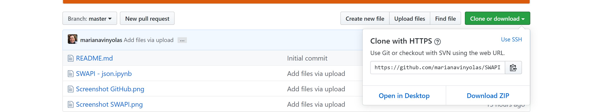

# SWAPI-project

### Star Wars API search program in Python language

I have stored the Python Code in a repository which you can download onto your computer.  

You can directly download the repository on **GitHub** by clicking on **Clone or Download** and then on **Download Zip**.

This Jupyter Notebook let users input the name of two characters and find out in which films they both have been in.

### *1. Internal code cells* 
Users’ needs to run this cells that imports the libraries and define functions required to perform the Star Wars API requests and search.

### *2. Users inputs and program output*
* These cells interact with users. First the program ask the user name and then ask for the name of two characters, one by one:  

`` Enter your first SW character name: ``  

`` Enter your second SW character name: ``  

* If the name selected doesn’t match with any name in the characters list, this message will be shown:  

``That is not a Star Wars character... Try again please!!!``  

* Users only have to run this cell once again and enter a correct name. After enter the names correctly, the program return the films names where both characters have been in.  

* Finally, there is a cell that shows the user a list of all the 87 characters to keep trying the search.  

I hope you enjoy this Star Wars API search program!

For more info about Star Wars API:  

<a href='https://swapi.co/' > SWAPI link: https://swapi.co/ </a>

